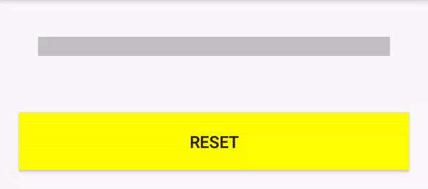
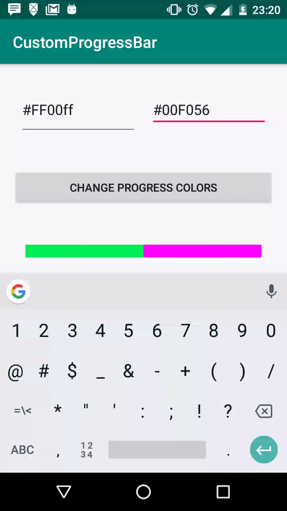

# Custom ProgressBar



## Creating custom xml

```
<?xml version="1.0" encoding="utf-8"?>
<layer-list xmlns:android="http://schemas.android.com/apk/res/android">
    <item android:id="@android:id/background">
        <shape>
            <solid
                android:color="#53207B" />
        </shape>
    </item>

    <item
        android:id="@android:id/progress">
        <clip>
            <shape>
                <solid
                    android:color="#F34349" />
            </shape>
        </clip>
    </item>

</layer-list>
```

In this code above, created the custom_progressbar.xml, with 2 colors (background and progress). 
Then, now we need add this xml in progressBar

```aidl
<ProgressBar
        android:id="@+id/progress"
        android:layout_width="match_parent"
        android:layout_height="wrap_content"
        android:layout_margin="32dp"
        android:layout_below="@+id/btn_change_progress"
        style="?android:attr/progressBarStyleHorizontal"
        android:background="@drawable/custom_progressbar"
        android:layout_centerInParent="true"/>
```

After that, we are ready to change this dyanmically. 

```aidl
    progress.progressDrawable = this.resources.getDrawable(R.drawable.custom_progressbar);
    
    val layerDrawable = progress.progressDrawable as LayerDrawable
    
    val bgGradientDrawable = layerDrawable
        .findDrawableByLayerId(android.R.id.background) as GradientDrawable
    bgGradientDrawable.setColor(offColor)
    
    val progressGradientDrawable = layerDrawable
        .findDrawableByLayerId(android.R.id.progress) as ClipDrawable
    progressGradientDrawable.setColorFilter(onColor, PorterDuff.Mode.SRC_IN)

```

